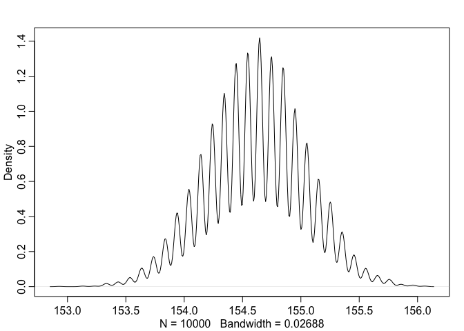

# Notes_StatisticalRethinking
Krisma Adiwibawa

``` r
library(rethinking)
```

    Loading required package: cmdstanr

    This is cmdstanr version 0.8.0

    - CmdStanR documentation and vignettes: mc-stan.org/cmdstanr

    - CmdStan path: /Users/krisma.adiwibawa/.cmdstan/cmdstan-2.36.0

    - CmdStan version: 2.36.0

    Loading required package: posterior

    This is posterior version 1.6.1


    Attaching package: 'posterior'

    The following objects are masked from 'package:stats':

        mad, sd, var

    The following objects are masked from 'package:base':

        %in%, match

    Loading required package: parallel

    rethinking (Version 2.42)


    Attaching package: 'rethinking'

    The following object is masked from 'package:stats':

        rstudent

## Chapter 2: Small Worlds and Large Worlds

### Grid Approximation in the Globe Tossing Context

``` r
# Step 1: Define grid
p_grid <- seq(0, 1, length.out=20)
# grid of 20 points. They act as the candidates of the parameter value. We know the proportion of water is between 0 (0 %, no water) and 1 (100%, all water). It's impossible to have a negative value or a value of more than 1, so we limit the candidates values to this range.
# We even know already that there is more water than land actually. But here we pretend we are dumb and we don't have this idea.

# Step 2: Define prior
prior <- rep(1, length(p_grid))
#### Prior alternatives:
# prior <- ifelse(p_grid < 0.5, 0, 1)
# We assign the prior likelihood of 0 to candidates < 0.5 and the prior likelihood of 1 to candidates >= 0.5
# or
# prior <- exp(-5 * abs(p_grid-0.5))
# exponential decay function / Laplace distribution. Pointy in the middle and has heavier tails than a Gaussian distribution. This is a prior which puts a higher likelihood to the middle value of range 0 and 1

# Step 3: Compute likelihood at each value in grid
likelihood <- dbinom(6, 9, p_grid)
# This is where the actual data informs us about the likelihood of each candidate (each element of p_grid). The data would suggest that some elements of p_grid are more likely than others.

# Step 4: Compute product of likelihood and prior
unstd.posterior <- likelihood * prior
# This is where our prior belief is updated by incorporating information we get from the data.
# prior <- rep(1, length(p_grid)) means "1" is multiplied to each element in the vector 'likelihood'. In other words, our prior is giving equal likelihood to each candidate because we didn't have any idea which candidate is more likely. Now, we are taking the likelihoods  in the vector 'likelihood' as our 'posterior' (updated belief).

# Step 5: Standardize the posterior, so it sums to 1
posterior <- unstd.posterior / sum(unstd.posterior)

# Result:
# Now we have the updated likelihood after seeing the data, namely 'posterior'.
# Explanation:
# First, we nominate 20 points between 0 and 1 as the candidates. We have no idea which is the most likely to be true parameter value.
# After seeing the data, we get some information about the likelihood of the candidates.
# We then update our prior with this information by multiplying the prior with the information we got from the data. In this case, all parameter candidate (the 20 points in the grid is equally likely (all have a prior of 1).
# Now, some candidates are more likely than others because the data informs us so. These likelihoods is contained in the vector 'posterior'.
```

### Visualization of the likelihood (posterior probability) of each 20 candidate

``` r
plot(p_grid, posterior, type="b", xlab = "probability of water", ylab = "posterior probability", main="20 points")
```


### Quadratic Approximation of the Globe Tossing Context (Try Out)

``` r
library(rethinking)

globe.qa <- quap(
  alist(
    W ~ dbinom(W+L, p), # binomial likelihood
    p ~ dunif(0,1) # uniform prior
    ),
    data=list(W=6, L=3)
)

# display summary of quadratic approximation
precis(globe.qa)
```

           mean        sd      5.5%     94.5%
    p 0.6666664 0.1571338 0.4155362 0.9177967

### Compare How Good the Quadratic Approximation is, With the Grid Approximation Result

``` r
# analytical calculation
W <- 6
L <- 3
curve(dbeta(x, W+1, L+1), from=0, to=1)

# quadratic approximation
curve(dnorm(x, 0.67, 0.16), lty=2, add=TRUE)
```


### Markov Chain Monte Carlo in the Globe Tossing Context (Try Out)

``` r
n_samples <- 1000
p <- rep(NA, n_samples)
p[1] <- 0.5
W <- 6
L <- 3
for (i in 2:n_samples) {
    p_new <- rnorm(1, p[i-1], 0.1)
    if (p_new < 0) p_new <- abs(p_new)
    if (p_new > 1) p_new <- 2- p_new
    q0 <- dbinom(W, W+L, p[i-1])
    q1 <- dbinom(W, W+L, p_new)
    p[i] <- ifelse(runif(1) < q1/q0, p_new, p[i-1])
}
```

#### The values in p are samples from the posterior distribution. To compare to the analytical posterior:

``` r
dens(p, xlim=c(0,1))
curve(dbeta(x, W+1, L+1), lty=2, add=TRUE)
```


## Chapter 3: Sampling the Imaginary

### Vampire test

``` r
Pr_Positive_Vampire <- 0.95
Pr_Positive_Mortal <- 0.01
Pr_Vampire <- 0.001
Pr_Positive <- Pr_Positive_Vampire * Pr_Vampire + Pr_Positive_Mortal * (1-Pr_Vampire)

(Pr_Vampire_Positive <- (Pr_Positive_Vampire * Pr_Vampire) / Pr_Positive)
```

    [1] 0.08683729

``` r
# 8.7% chance that the suspect is actually a vampire
```

### Sampling from a grid-approximate posterior

``` r
p_grid <- seq(from=0, to=1, length.out=10000)
prob_p <- rep(1, 10000)
prob_data <- dbinom(6, size=9, prob=p_grid)
posterior <- prob_data * prob_p
posterior <- posterior / sum(posterior)
```

### Now, we want to take 10000 samples from the posterior

``` r
samples <- sample(p_grid, prob=posterior, size=1e4, replace=TRUE)
View(table(samples))
plot(samples)
```


``` r
dens(samples)
```


### Ch. 3 - Practice

``` r
p_grid <- seq(from=0, to=1, length.out=1000)
prior <- rep(1, 1000)
likelihood <- dbinom(6, size=9, prob=p_grid)
posterior <- likelihood * prior
posterior <- posterior / sum(posterior)
set.seed(100)
samples <- sample(p_grid, prob=posterior, size=1e4, replace=TRUE)

# How much posterior probability lies below p = 0.2?
(sum(samples < 0.2)/1e4)
```

    [1] 4e-04

``` r
# How much posterior probability lies above p = 0.8?
(sum(samples > 0.8)/1e4)
```

    [1] 0.1116

``` r
# How much posterior probability lies between p = 0.2 and p = 0.8?
(sum(samples > 0.2 & samples < 0.8)/1e4)
```

    [1] 0.888

``` r
# 20% of the posterior probability lies below which value of p?
(quantile(samples, 0.2))
```

          20% 
    0.5185185 

``` r
# 20% of the posterior probability lies above which value of p?
(quantile(samples, 0.8))
```

          80% 
    0.7557558 

``` r
# Which values of p contain the narrowest interval equal to 66% of the posterior probability?
(HPDI(samples, prob=0.66))
```

        |0.66     0.66| 
    0.5085085 0.7737738 

``` r
# Suppose the globe tossing data had turned out to be 8 water in 15 tosses. Construct the posterior distribution, using grid approximation. Use the same flat prior as before.
p_grid <- seq(from=0, to=1, length.out=1000)
prior <- rep(1, 1000)
likelihood <- dbinom(8, size=15, prob=p_grid)
posterior <- likelihood * prior
posterior <- posterior/sum(posterior)

plot(p_grid, posterior, type="b",
     xlab="probability of water", ylab="posterior probability")
mtext("20 points")
```


``` r
# Draw 10,000 samples from the grid approximation from above. Then use the samples to calculate the 90% HPDI for p.

samples <- sample(p_grid, prob=posterior, size=1e4, replace=TRUE)

(HPDI(samples, prob=0.9))
```

         |0.9      0.9| 
    0.3293293 0.7167167 

``` r
plot(samples)
```


``` r
dens(samples)
```


``` r
precis(samples)
```

                 mean        sd      5.5%     94.5% histogram
    samples 0.5301517 0.1175499 0.3363363 0.7157157  ▁▁▂▇▇▅▂▁

``` r
# Construct a posterior predictive check for this model and data. This means simulate the distribution of samples, averaging over the posterior uncertainty in p. What is the probability of observing 8 water in 15 tosses?

post_pred_check <- rbinom(1e4, size=15, prob=samples)
(mean(post_pred_check == 8))
```

    [1] 0.1444

``` r
simplehist(post_pred_check, xlab="posterior predictive distribution")
```


``` r
# Using the posterior distribution constructed from the new (8/15) data, now calculate the probability of observing 6 water in 9 tosses

prob_6_in_9 <- sum( dbinom(6, size=9, prob=p_grid) * posterior )
prob_6_in_9
```

    [1] 0.1763898

``` r
# or

prob_6_in_9 <- mean( dbinom(6, size=9, prob=samples) )
prob_6_in_9
```

    [1] 0.1770468

``` r
# visualization
set.seed(123)
post_pred_samples <- rbinom(10000, size=9, prob=samples)
simplehist(post_pred_samples, xlab="Number of water tosses")
```


``` r
## R code 3.28
birth1 <- c(1,0,0,0,1,1,0,1,0,1,0,0,1,1,0,1,1,0,0,0,1,0,0,0,1,0,
0,0,0,1,1,1,0,1,0,1,1,1,0,1,0,1,1,0,1,0,0,1,1,0,1,0,0,0,0,0,0,0,
1,1,0,1,0,0,1,0,0,0,1,0,0,1,1,1,1,0,1,0,1,1,1,1,1,0,0,1,0,1,1,0,
1,0,1,1,1,0,1,1,1,1)
birth2 <- c(0,1,0,1,0,1,1,1,0,0,1,1,1,1,1,0,0,1,1,1,0,0,1,1,1,0,
1,1,1,0,1,1,1,0,1,0,0,1,1,1,1,0,0,1,0,1,1,1,1,1,1,1,1,1,1,1,1,1,
1,1,1,0,1,1,0,1,1,0,1,1,1,0,0,0,0,0,0,1,0,0,0,1,1,0,0,1,0,0,1,1,
0,0,0,1,1,1,0,0,0,0)
# These data indicate the gender (male=1, female=0) of officially reported first and second born children in 100 two-child families.

(sum(birth1)+sum(birth2))
```

    [1] 111

``` r
# Using grid approximation, compute the posterior distribution for the probability of a birth being a boy. Assume a uniform probability. Which parameter value maximizes the posterior probability?

p_grid <- seq(0, 1, length.out=1000)
prior <- rep(1, length(p_grid))
# prior <- rep(1, length(p_grid)) This corresponds to a uniform distribution or beta(1,1), which

n_boys <- sum(birth1)+sum(birth2)
n_total <- length(birth1)+length(birth2)

likelihood <- dbinom(n_boys, n_total, prob= p_grid)

posterior <- likelihood * prior
posterior <- posterior/sum(posterior)

# Plot posterior
plot(p_grid, posterior, type = "l", lwd = 2, col = "blue",
     xlab = "Probability of a boy (p)",
     ylab = "Posterior probability",
     main = "Posterior Distribution of p (Grid Approximation)")

# Which parameter value maximizes the posterior probability?
p_MAP <- p_grid[which.max(posterior)]
p_MAP
```

    [1] 0.5545546

``` r
abline(v = p_MAP, col = "red", lty = 2)
text(p_MAP, max(posterior), labels = paste0("MAP=", round(p_MAP, 3)),
     pos = 4, col = "red")
```


``` r
# Using the 'sample' function, draw 10000 random parameter values from the posterior distribution you calculated above. Use these samples to estimate the 50%, 89%, and 97% highest posterior density intervals.

set.seed(123)
posterior_samples <- sample(p_grid, size=10000, replace=TRUE, prob=posterior)

HPDI(posterior_samples, prob=0.5)
```

         |0.5      0.5| 
    0.5255255 0.5725726 

``` r
HPDI(posterior_samples, prob=0.89)
```

        |0.89     0.89| 
    0.5005005 0.6106106 

``` r
HPDI(posterior_samples, prob=0.97)
```

        |0.97     0.97| 
    0.4764765 0.6276276 

``` r
# Use 'rbinom' to simulate 10000 replicates of 200 births. You should end up with 10000 numbers, each one a count of boys out of 200 births. Compare the distribution of predicted numbers of boys to the actual count in the data (111 boys out of 200 births. There are many good ways to visualize the simulations, but the 'dens' command (part of 'rethinking' package) is probably the easiest way in this case. Does it look like the model fits the data well? That is, does the distribution of predictions include the actual observation as a central, likely outcome?

set.seed(123)
posterior_predictive_dist_boys <- rbinom(n=10000, size=200, prob=posterior_samples)
# this is creating a 10000 'counts of boys out of 200 births'. Each element in the posterior_samples vector (10000 parameter candidates, whose distribution reflects the updated probabilities of each parameter candidate) determines the count of boys for each element of 'posterior_predictive_dist_boys'.

simplehist(posterior_predictive_dist_boys, main="Predicted Distribution of Boys (out of 200 Births)", xlab="Number of Boys")

abline(v = 111, col = "red", lwd = 2)
text(111, max(table(posterior_predictive_dist_boys))*0.97, "Actual: 111", col="red", pos=4)
```


``` r
# Now compare 10000 counts of boys from 100 simulated first borns only to the number of boys in the first births, birth1. How does the model look in this light?

actual_first_boys <- sum(birth1)

set.seed(123)
first_boys_simulation <- rbinom(n=10000, size=100, prob=posterior_samples)

simplehist(first_boys_simulation, xlab="Number of boys (first borns", ylab="Frequency", main="Posterior Predictive Distribution for First-Borns")

abline(v = actual_first_boys, col = "red", lwd = 2)
text(actual_first_boys, max(table(first_boys_simulation))*0.9, 
     paste("Actual:", actual_first_boys), col="red", pos=2)
```


``` r
# The model assumes that sex of first and second births are independent. To check this assumption, focus now on second births that followed female first borns. Compare 10000 simulated counts of boys to only those second births that followed girls. To do this correctly, you need to count the number of first borns who were girls and simulate that many births, 10000 times. Compare the counts of boys in your simulations to the actual observed count of boys following girls. How does the model look in this light? Any guesses what is going on in these data?

girls_first <- which(birth1==0) # index of girl births
num_girls_first <- length(girls_first) # total number of girl births

actual_boys_after_girls <- sum(birth2[girls_first]) # total number of boys born after a girl

set.seed(123)
sim_boys_after_girls <- rbinom(n=10000, size=num_girls_first, prob=posterior_samples)

simplehist(sim_boys_after_girls, 
           xlab = "Number of boys (second-borns after girls)", 
           ylab = "Frequency", 
           main = "Posterior Predictive for Second-Borns after Girls")

abline(v = actual_boys_after_girls, col = "red", lwd = 2)
text(actual_boys_after_girls, max(table(sim_boys_after_girls))*0.9, 
     paste("Actual:", actual_boys_after_girls), col="red", pos=2)
```


``` r
# Trying out creating a model predicting the birth of boys after girls
index_girls_first <- which(birth1==0)
num_girls_first <- length(index_girls_first)
actual_boys_after_girls <- sum(birth2[index_girls_first])

set.seed(123)
p_grid <- seq(from=0, to=1, length.out=1000)
prior <- rep(1, length(p_grid))

likelihood <- dbinom(actual_boys_after_girls, num_girls_first, prob=p_grid)
posterior <- likelihood * prior
posterior <- likelihood/sum(likelihood)

posterior_samples <- sample(p_grid, prob=posterior, size=10000, replace=TRUE)

set.seed(123)
posterior_predictive_simulation <- rbinom(10000, size=num_girls_first, prob=posterior_samples)

simplehist(posterior_predictive_simulation,
           xlab="Number of boys (second-born",
           ylab="Frequency",
           mein="Posterior Predictive for Second-Born Boys after Girls")
```

    Warning in plot.window(...): "mein" is not a graphical parameter

    Warning in plot.xy(xy, type, ...): "mein" is not a graphical parameter

    Warning in axis(side = side, at = at, labels = labels, ...): "mein" is not a
    graphical parameter
    Warning in axis(side = side, at = at, labels = labels, ...): "mein" is not a
    graphical parameter

    Warning in box(...): "mein" is not a graphical parameter

    Warning in title(...): "mein" is not a graphical parameter

    Warning in axis(...): "mein" is not a graphical parameter

``` r
abline(v = actual_boys_after_girls, col='red', lwd=2)
text(actual_boys_after_girls, max(table(posterior_samples)),
     paste("Actual:", actual_boys_after_girls), col='red', pos=2)
```


``` r
# So, if the data to be predicted has some assumption that is incorporated in the model, the model is going to predict the data well.
```

## Chapter 4 - Geocentric Models

### Grid Approximation applied to a model with more than one parameter

``` r
pos <- replicate(1000, sum(runif(16,-1,1)))

hist(pos)
```


``` r
plot(density(pos))
```


``` r
growth <- replicate(10000, prod(1+runif(12, 0, 0.1)))
dens(growth, norm.comp=TRUE)
```


``` r
big <- replicate(10000, prod(1+(runif(12, 0, 0.5))))
small <- replicate(10000, prod(1+(runif(12, 0, 0.1))))

dens(big, norm.comp=TRUE)
```


``` r
dens(small, norm.comp=TRUE)
```


``` r
log.big <- replicate(10000, log(prod(1+(runif(12, 0, 0.5)))))
dens(log.big, norm.comp=TRUE)
```


``` r
w <- 6; n <- 9
p_grid <- seq(from=0, to=1, length.out=100)
posterior <- dbinom(w, n, p_grid) * dunif(p_grid, 0, 1)
posterior <- posterior/sum(posterior)
# dunif(p_grid, 0, 1) = d --> density, it is giving the probability density function (PDF), in this case, of a uniform distribution. So for every p_grid it gives probability of '1'.

samples <- sample(p_grid, size=10000, replace=TRUE, prob=posterior)

# plot the p_grid and posterior probability
plot(p_grid, posterior, type='b', xlab="p_grid", ylab="posterior probability")
```


``` r
# plot the simulated samples of 10000 p_grid with probabilities from the posterior
dens(samples)
```


``` r
# summary metrics
p_grid[which.max(posterior)]
```

    [1] 0.6666667

``` r
# MAP (maximum a posteriori) from posterior / the index of p_grid which has the highest posterior
chainmode(samples, adj=0.01)
```

    [1] 0.6361986

``` r
# MAP (maximum a posteriori) from samples / find the mode of a continuous density estimate
HPDI(samples, 0.05) # Highest Posterior Density Interval
```

        |0.05     0.05| 
    0.5757576 0.5858586 

``` r
PI(samples, 0.05) # Percentiles Interval
```

          48%       52% 
    0.6363636 0.6565657 

``` r
library(rethinking)
data(Howell1)
# str(Howell1)
d <- Howell1
# precis(d)

d$height # return the column 'height' only from data frame 'd'
```

      [1] 151.7650 139.7000 136.5250 156.8450 145.4150 163.8300 149.2250 168.9100
      [9] 147.9550 165.1000 154.3050 151.1300 144.7800 149.9000 150.4950 163.1950
     [17] 157.4800 143.9418 121.9200 105.4100  86.3600 161.2900 156.2100 129.5400
     [25] 109.2200 146.4000 148.5900 147.3200 137.1600 125.7300 114.3000 147.9550
     [33] 161.9250 146.0500 146.0500 152.7048 142.8750 142.8750 147.9550 160.6550
     [41] 151.7650 162.8648 171.4500 147.3200 147.9550 144.7800 121.9200 128.9050
     [49]  97.7900 154.3050 143.5100 146.7000 157.4800 127.0000 110.4900  97.7900
     [57] 165.7350 152.4000 141.6050 158.8000 155.5750 164.4650 151.7650 161.2900
     [65] 154.3050 145.4150 145.4150 152.4000 163.8300 144.1450 129.5400 129.5400
     [73] 153.6700 142.8750 146.0500 167.0050 158.4198  91.4400 165.7350 149.8600
     [81] 147.9550 137.7950 154.9400 160.9598 161.9250 147.9550 113.6650 159.3850
     [89] 148.5900 136.5250 158.1150 144.7800 156.8450 179.0700 118.7450 170.1800
     [97] 146.0500 147.3200 113.0300 162.5600 133.9850 152.4000 160.0200 149.8600
    [105] 142.8750 167.0050 159.3850 154.9400 148.5900 111.1250 111.7600 162.5600
    [113] 152.4000 124.4600 111.7600  86.3600 170.1800 146.0500 159.3850 151.1300
    [121] 160.6550 169.5450 158.7500  74.2950 149.8600 153.0350  96.5200 161.9250
    [129] 162.5600 149.2250 116.8400 100.0760 163.1950 161.9250 145.4150 163.1950
    [137] 151.1300 150.4950 141.6050 170.8150  91.4400 157.4800 152.4000 149.2250
    [145] 129.5400 147.3200 145.4150 121.9200 113.6650 157.4800 154.3050 120.6500
    [153] 115.6000 167.0050 142.8750 152.4000  96.5200 160.0000 159.3850 149.8600
    [161] 160.6550 160.6550 149.2250 125.0950 140.9700 154.9400 141.6050 160.0200
    [169] 150.1648 155.5750 103.5050  94.6150 156.2100 153.0350 167.0050 149.8600
    [177] 147.9550 159.3850 161.9250 155.5750 159.3850 146.6850 172.7200 166.3700
    [185] 141.6050 142.8750 133.3500 127.6350 119.3800 151.7650 156.8450 148.5900
    [193] 157.4800 149.8600 147.9550 102.2350 153.0350 160.6550 149.2250 114.3000
    [201] 100.9650 138.4300  91.4400 162.5600 149.2250 158.7500 149.8600 158.1150
    [209] 156.2100 148.5900 143.5100 154.3050 131.4450 157.4800 157.4800 154.3050
    [217] 107.9500 168.2750 145.4150 147.9550 100.9650 113.0300 149.2250 154.9400
    [225] 162.5600 156.8450 123.1900 161.0106 144.7800 143.5100 149.2250 110.4900
    [233] 149.8600 165.7350 144.1450 157.4800 154.3050 163.8300 156.2100 153.6700
    [241] 134.6200 144.1450 114.3000 162.5600 146.0500 120.6500 154.9400 144.7800
    [249] 106.6800 146.6850 152.4000 163.8300 165.7350 156.2100 152.4000 140.3350
    [257] 158.1150 163.1950 151.1300 171.1198 149.8600 163.8300 141.6050  93.9800
    [265] 149.2250 105.4100 146.0500 161.2900 162.5600 145.4150 145.4150 170.8150
    [273] 127.0000 159.3850 159.4000 153.6700 160.0200 150.4950 149.2250 127.0000
    [281] 142.8750 142.1130 147.3200 162.5600 164.4650 160.0200 153.6700 167.0050
    [289] 151.1300 147.9550 125.3998 111.1250 153.0350 139.0650 152.4000 154.9400
    [297] 147.9550 143.5100 117.9830 144.1450  92.7100 147.9550 155.5750 150.4950
    [305] 155.5750 154.3050 130.6068 101.6000 157.4800 168.9100 150.4950 111.7600
    [313] 160.0200 167.6400 144.1450 145.4150 160.0200 147.3200 164.4650 153.0350
    [321] 149.2250 160.0200 149.2250  85.0900  84.4550  59.6138  92.7100 111.1250
    [329]  90.8050 153.6700  99.6950  62.4840  81.9150  96.5200  80.0100 150.4950
    [337] 151.7650 140.6398  88.2650 158.1150 149.2250 151.7650 154.9400 123.8250
    [345] 104.1400 161.2900 148.5900  97.1550  93.3450 160.6550 157.4800 167.0050
    [353] 157.4800  91.4400  60.4520 137.1600 152.4000 152.4000  81.2800 109.2200
    [361]  71.1200  89.2048  67.3100  85.0900  69.8500 161.9250 152.4000  88.9000
    [369]  90.1700  71.7550  83.8200 159.3850 142.2400 142.2400 168.9100 123.1900
    [377]  74.9300  74.2950  90.8050 160.0200  67.9450 135.8900 158.1150  85.0900
    [385]  93.3450 152.4000 155.5750 154.3050 156.8450 120.0150 114.3000  83.8200
    [393] 156.2100 137.1600 114.3000  93.9800 168.2750 147.9550 139.7000 157.4800
    [401]  76.2000  66.0400 160.7000 114.3000 146.0500 161.2900  69.8500 133.9850
    [409]  67.9450 150.4950 163.1950 148.5900 148.5900 161.9250 153.6700  68.5800
    [417] 151.1300 163.8300 153.0350 151.7650 132.0800 156.2100 140.3350 158.7500
    [425] 142.8750  84.4550 151.9428 161.2900 127.9906 160.9852 144.7800 132.0800
    [433] 117.9830 160.0200 154.9400 160.9852 165.9890 157.9880 154.9400  97.9932
    [441]  64.1350 160.6550 147.3200 146.7000 147.3200 172.9994 158.1150 147.3200
    [449] 124.9934 106.0450 165.9890 149.8600  76.2000 161.9250 140.0048  66.6750
    [457]  62.8650 163.8300 147.9550 160.0200 154.9400 152.4000  62.2300 146.0500
    [465] 151.9936 157.4800  55.8800  60.9600 151.7650 144.7800 118.1100  78.1050
    [473] 160.6550 151.1300 121.9200  92.7100 153.6700 147.3200 139.7000 157.4800
    [481]  91.4400 154.9400 143.5100  83.1850 158.1150 147.3200 123.8250  88.9000
    [489] 160.0200 137.1600 165.1000 154.9400 111.1250 153.6700 145.4150 141.6050
    [497] 144.7800 163.8300 161.2900 154.9000 161.3000 170.1800 149.8600 123.8250
    [505]  85.0900 160.6550 154.9400 106.0450 126.3650 166.3700 148.2852 124.4600
    [513]  89.5350 101.6000 151.7650 148.5900 153.6700  53.9750 146.6850  56.5150
    [521] 100.9650 121.9200  81.5848 154.9400 156.2100 132.7150 125.0950 101.6000
    [529] 160.6550 146.0500 132.7150  87.6300 156.2100 152.4000 162.5600 114.9350
    [537]  67.9450 142.8750  76.8350 145.4150 162.5600 156.2100  71.1200 158.7500

``` r
d2 <- d[d$age >= 18,] # filter only the rows where the age is >= 18

# plot the distribution of heights
dens(d2$height)
```


``` r
# plot the prior of height
curve(dnorm(x,, 178, 20), from=100, to=250)
```


``` r
# plot the prior of standard deviation (flat and uniform, just to constrain SD to have a positive probability between zero and 50cm)
curve(dunif(x, 0, 50), from=10, to=60)
```


``` r
# simulating heights by sampling from the prior
sample_mu <- rnorm(1e4, 178, 20)
sample_sigma <- runif(1e4, 0, 50)
prior_h <- rnorm(1e4, sample_mu, sample_sigma)
dens(prior_h)
```


``` r
# Grid Approximation
mu.list <- seq(from=150, to=160, length.out=100)
sigma.list <- seq(from=7, to=9, length.out=100)
post <- expand.grid(mu=mu.list, sigma=sigma.list)
post$LL <- sapply(1:nrow(post),
                  function(i) sum(
                        dnorm(d2$height, post$mu[i], post$sigma[i], log=TRUE)
                  ))
post$prod <- post$LL + dnorm(post$mu, 178, 20, TRUE) + dunif(post$sigma, 0, 50, TRUE)
post$prob <- exp(post$prod - max(post$prod))
# posterior resides in post$prob

# simple contour plot
contour_xyz(post$mu, post$sigma, post$prob)
```


``` r
# simple heat map
image_xyz(post$mu, post$sigma, post$prob)
```


``` r
# Again, we sample the parameter values of p from the posterior. But because we have 2 parameters here we want to sample combinations of them, the new trick is:
# first, randomly sample row numbers in 'post' in proportion to the values in 'post$prob'.
# Then, we pull out the parameter values on those randomly sampled rows.

# This code will do it:
sample.rows <- sample(1:nrow(post), size=1e4, replace=TRUE, prob=post$prob)
sample.mu <- post$mu[sample.rows]
sample.sigma <- post$sigma[sample.rows]
# You end up with 10000 samples, with replacement, from the posterior for the height data.

plot(sample.mu, sample.sigma, cex=1, pch=16, col=col.alpha(rangi2, 0.22))
```


``` r
# Samples from the posterior distribution for the heights data. The density of points is highest in the center, reflecting the most plausible combinations of mu and sigma.

# Now that you have these samples, you can describe the distribution of confidence in each  combination of mu and sigma by summarizing the samples.

# To characterize the shapes of the 'marginal' posterior densities of mu and sigma, all we need to do is:
dens(sample.mu)
```



``` r
dens(sample.sigma)
```


``` r
# to summarize the widths of these densities with posterior compatibility intervals:
PI(sample.mu)
```

          5%      94% 
    153.9394 155.2525 

``` r
PI(sample.sigma)
```

          5%      94% 
    7.323232 8.252525 

``` r
# Since these samples are just vectors of numbers, you can compute any statistic from them that you could from ordinary data: mean, median, or quantile, for example.
summary(sample.mu)
```

       Min. 1st Qu.  Median    Mean 3rd Qu.    Max. 
      152.9   154.3   154.6   154.6   154.8   156.1 

``` r
summary(sample.sigma)
```

       Min. 1st Qu.  Median    Mean 3rd Qu.    Max. 
      7.000   7.566   7.768   7.773   7.970   8.899 

### Quadratic Approximation to the same model (parameters: mu and sigma)

``` r
# Quadratic Approximation's goal is to quickly make inferences about the shape of the posterior. The posterior's peak will lie at the Maximum A Posteriori (MAP) estimate, and we can get a useful image of the posterior's shape by using the quadratic approximation of the posterior distribution at this peak.

library(rethinking)
data(Howell1)
d <- Howell1
d2 <- d[d$age >= 18,]

# Now we define the model using R's formula syntax:
flist <- alist(
           height ~ dnorm(mu, sigma),
           mu ~ dnorm(178, 20),
           sigma ~ dunif(0, 50)
)

# Now we fit the model to the data in the data frame d2 with:
m4.1 <- quap(flist, data=d2)

# AFter executing this code, you'll have a fit model stored in the symbol m4.1. Now take a look at the posterior:
precis(m4.1)
```

                mean        sd       5.5%      94.5%
    mu    154.607136 0.4119772 153.948717 155.265556
    sigma   7.731005 0.2913551   7.265363   8.196647

``` r
# These numbers provide Gaussian approximations for each parameter's 'marginal' distribution. This means the plausibility of each value of mu, after averaging over the plausibilities of each value of sigma, is given by a Gaussian distribution with mean 154.6 and standard deviation 0.4

# Sampling from quap.
# How do you then get samples from the quadratic approximation of the posterior distribution? The answer is rather simple, but non-obvious, and it requires recognizing that a quadratic approximation to a posterior distribution with more  than one parameter dimension – mu and sigma each contribute one dimension – is just a multi-dimensional Gaussian distribution.
# As a consequence, when R constructs a quadratic approximation, it calculates not only standard deviations for all parameters, but also the covariances among all pairs of  parameters.
# To see this matrix of variances and covariances, for model m4.1, use:
vcov(m4.1)
```

                    mu        sigma
    mu    0.1697252341 0.0002204705
    sigma 0.0002204705 0.0848878230

``` r
# It is composed of
# (1) a vector of variances for the parameters
diag(vcov(m4.1))
```

            mu      sigma 
    0.16972523 0.08488782 

``` r
# (2) a correlation matrix that tells us how changes in any parameter lead to correlated changes in others
cov2cor(vcov(m4.1))
```

                   mu       sigma
    mu    1.000000000 0.001836769
    sigma 0.001836769 1.000000000

``` r
# So how do we get samples from this multi-dimensional posterior? Now instead of sampling single values from a simple Gaussian distribution, we sample vectors of values from a multi-dimensional Gaussian distribution. The 'rethinking' package provides a convenience function to do just that:
library(rethinking)
post <- extract.samples(m4.1, n=1e4)
head(post)
```

            mu    sigma
    1 154.9544 8.188157
    2 154.3997 7.638522
    3 154.3616 7.672734
    4 154.1439 7.754294
    5 154.3685 7.885267
    6 154.2622 7.477866

``` r
# You end up with a data frame, post, with 10000 (1e4) rows and two columns, one column for mu and one for sigma. Each value is a sample from the posterior, so the mean and standard deviation of each column will be very close to the MAP values from before. You can confirm this by summarizing the samples:
precis(post)
```

               mean        sd       5.5%      94.5%      histogram
    mu    154.61117 0.4132063 153.951679 155.268780        ▁▁▅▇▂▁▁
    sigma   7.73114 0.2943769   7.259291   8.201164 ▁▁▁▁▁▂▅▇▇▃▁▁▁▁

``` r
# We can plot it too:
plot(post)
```


``` r
# The high degree of similarity between the 'post' from quadratic approximation and 'm4.1 from grid approximation is because these samples also preserve the covariance between mu and sigma.
```

When a predictor variable is built inside the model in a particular way
, we’ll have a linear regression. So, now let’s look at how height in
these Kalahari foragers (the outcome variable) covaries with weight (the
predictor variable).

Go ahead and plot adult height and weight against one another:

``` r
library(rethinking)
data(Howell1)

d <- Howell1
d2 <- d[d$age >=18,]

plot (d2$height ~ d2$weight)
```


How do we take our Gaussian model from the previous section and
incorporate predictor variables?

The linear model strategy. The strategy is to make the parameter for the
mean of a Gaussian distribution, mu, into a linear function of the
predictor variable and other, new parameters that we invent.

We ask the golem: “Consider all the lines that relate one variable to
the other. Rank all of these lines by plausibility, given these data.”
The golem answers with a posterior distribution.

``` r
# define the average weight, x-bar
xbar <- mean(d2$weight)

# fit model
m4.3 <- quap(
        alist(
          height ~ dnorm(mu, sigma),
          mu <- a + b*(weight-xbar),
          a ~ dnorm(178, 20),
          b ~ dlnorm(0,1), # dlnorm is log-normal distribution to enforce positive values; see p. 96.
          sigma ~ dunif(0,50)),
        data=d2)
```
