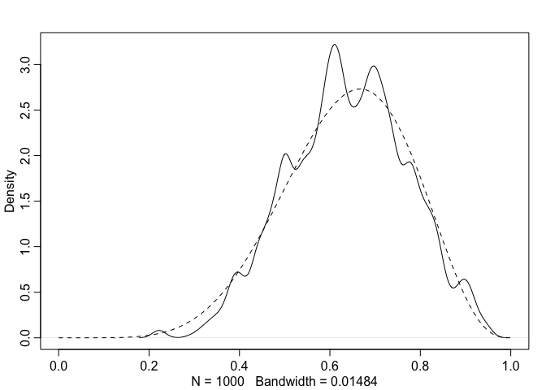
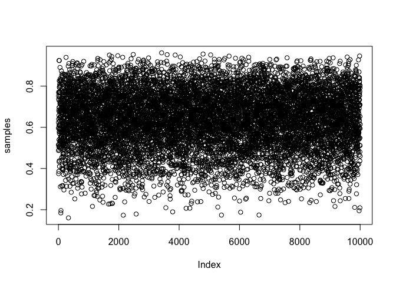

# Notes_StatisticalRethinking
Krisma Adiwibawa

## Chapter 2: Small Worlds and Large Worlds

### Grid Approximation in the Globe Tossing Context

``` r
# Step 1: Define grid
p_grid <- seq(0, 1, length.out=20)
# grid of 20 points. They act as the candidates of the parameter value. We know the proportion of water is between 0 (0 %, no water) and 1 (100%, all water). It's impossible to have a negative value or a value of more than 1, so we limit the candidates values to this range.
# We even know already that there is more water than land actually. But here we pretend we are dumb and we don't have this idea.

# Step 2: Define prior
prior <- rep(1, length(p_grid))
#### Prior alternatives:
# prior <- ifelse(p_grid < 0.5, 0, 1)
# We assign the prior likelihood of 0 to candidates < 0.5 and the prior likelihood of 1 to candidates >= 0.5
# or
# prior <- exp(-5 * abs(p_grid-0.5))
# exponential decay function / Laplace distribution. Pointy in the middle and has heavier tails than a Gaussian distribution. This is a prior which puts a higher likelihood to the middle value of range 0 and 1

# Step 3: Compute likelihood at each value in grid
likelihood <- dbinom(6, 9, p_grid)
# This is where the actual data informs us about the likelihood of each candidate (each element of p_grid). The data would suggest that some elements of p_grid are more likely than others.

# Step 4: Compute product of likelihood and prior
unstd.posterior <- likelihood * prior
# This is where our prior belief is updated by incorporating information we get from the data.
# prior <- rep(1, length(p_grid)) means "1" is multiplied to each element in the vector 'likelihood'. In other words, our prior is giving equal likelihood to each candidate because we didn't have any idea which candidate is more likely. Now, we are taking the likelihoods  in the vector 'likelihood' as our 'posterior' (updated belief).

# Step 5: Standardize the posterior, so it sums to 1
posterior <- unstd.posterior / sum(unstd.posterior)

# Result:
# Now we have the updated likelihood after seeing the data, namely 'posterior'.
# Explanation:
# First, we nominate 20 points between 0 and 1 as the candidates. We have no idea which is the most likely to be true parameter value.
# After seeing the data, we get some information about the likelihood of the candidates.
# We then update our prior with this information by multiplying the prior with the information we got from the data. In this case, all parameter candidate (the 20 points in the grid is equally likely (all have a prior of 1).
# Now, some candidates are more likely than others because the data informs us so. These likelihoods is contained in the vector 'posterior'.
```

### Visualization of the likelihood (posterior probability) of each 20 candidate

``` r
plot(p_grid, posterior, type="b", xlab = "probability of water", ylab = "posterior probability", main="20 points")
```


### Quadratic Approximation of the Globe Tossing Context (Try Out)

``` r
library(rethinking)
```

    Loading required package: cmdstanr

    This is cmdstanr version 0.8.0

    - CmdStanR documentation and vignettes: mc-stan.org/cmdstanr

    - CmdStan path: /Users/krisma.adiwibawa/.cmdstan/cmdstan-2.36.0

    - CmdStan version: 2.36.0

    Loading required package: posterior

    This is posterior version 1.6.1


    Attaching package: 'posterior'

    The following objects are masked from 'package:stats':

        mad, sd, var

    The following objects are masked from 'package:base':

        %in%, match

    Loading required package: parallel

    rethinking (Version 2.42)


    Attaching package: 'rethinking'

    The following object is masked from 'package:stats':

        rstudent

``` r
globe.qa <- quap(
  alist(
    W ~ dbinom(W+L, p), # binomial likelihood
    p ~ dunif(0,1) # uniform prior
    ),
    data=list(W=6, L=3)
)

# display summary of quadratic approximation
precis(globe.qa)
```

           mean        sd      5.5%     94.5%
    p 0.6666663 0.1571339 0.4155361 0.9177966

### Compare How Good the Quadratic Approximation is, With the Grid Approximation Result

``` r
# analytical calculation
W <- 6
L <- 3
curve(dbeta(x, W+1, L+1), from=0, to=1)

# quadratic approximation
curve(dnorm(x, 0.67, 0.16), lty=2, add=TRUE)
```


### Markov Chain Monte Carlo in the Globe Tossing Context (Try Out)

``` r
n_samples <- 1000
p <- rep(NA, n_samples)
p[1] <- 0.5
W <- 6
L <- 3
for (i in 2:n_samples) {
    p_new <- rnorm(1, p[i-1], 0.1)
    if (p_new < 0) p_new <- abs(p_new)
    if (p_new > 1) p_new <- 2- p_new
    q0 <- dbinom(W, W+L, p[i-1])
    q1 <- dbinom(W, W+L, p_new)
    p[i] <- ifelse(runif(1) < q1/q0, p_new, p[i-1])
}
```

#### The values in p are samples from the posterior distribution. To compare to the analytical posterior:

``` r
dens(p, xlim=c(0,1))
curve(dbeta(x, W+1, L+1), lty=2, add=TRUE)
```



## Chapter 3: Sampling the Imaginary

### Vampire test

``` r
Pr_Positive_Vampire <- 0.95
Pr_Positive_Mortal <- 0.01
Pr_Vampire <- 0.001
Pr_Positive <- Pr_Positive_Vampire * Pr_Vampire + Pr_Positive_Mortal * (1-Pr_Vampire)

(Pr_Vampire_Positive <- (Pr_Positive_Vampire * Pr_Vampire) / Pr_Positive)
```

    [1] 0.08683729

``` r
# 8.7% chance that the suspect is actually a vampire
```

### Sampling from a grid-approximate posterior

``` r
p_grid <- seq(from=0, to=1, length.out=10000)
prob_p <- rep(1, 10000)
prob_data <- dbinom(6, size=9, prob=p_grid)
posterior <- prob_data * prob_p
posterior <- posterior / sum(posterior)
```

### Now, we want to take 10000 samples from the posterior

``` r
samples <- sample(p_grid, prob=posterior, size=1e4, replace=TRUE)
View(table(samples))
plot(samples)
```


``` r
dens(samples)
```


### Ch. 3 - Practice

``` r
p_grid <- seq(from=0, to=1, length.out=1000)
prior <- rep(1, 1000)
likelihood <- dbinom(6, size=9, prob=p_grid)
posterior <- likelihood * prior
posterior <- posterior / sum(posterior)
set.seed(100)
samples <- sample(p_grid, prob=posterior, size=1e4, replace=TRUE)

# How much posterior probability lies below p = 0.2?
(sum(samples < 0.2)/1e4)
```

    [1] 4e-04

``` r
# How much posterior probability lies above p = 0.8?
(sum(samples > 0.8)/1e4)
```

    [1] 0.1116

``` r
# How much posterior probability lies between p = 0.2 and p = 0.8?
(sum(samples > 0.2 & samples < 0.8)/1e4)
```

    [1] 0.888

``` r
# 20% of the posterior probability lies below which value of p?
(quantile(samples, 0.2))
```

          20% 
    0.5185185 

``` r
# 20% of the posterior probability lies above which value of p?
(quantile(samples, 0.8))
```

          80% 
    0.7557558 

``` r
# Which values of p contain the narrowest interval equal to 66% of the posterior probability?
(HPDI(samples, prob=0.66))
```

        |0.66     0.66| 
    0.5085085 0.7737738 

``` r
# Suppose the globe tossing data had turned out to be 8 water in 15 tosses. Construct the posterior distribution, using grid approximation. Use the same flat prior as before.
p_grid <- seq(from=0, to=1, length.out=1000)
prior <- rep(1, 1000)
likelihood <- dbinom(8, size=15, prob=p_grid)
posterior <- likelihood * prior
posterior <- posterior/sum(posterior)

plot(p_grid, posterior, type="b",
     xlab="probability of water", ylab="posterior probability")
mtext("20 points")
```



``` r
# Draw 10,000 samples from the grid approximation from above. Then use the samples to calculate the 90% HPDI for p.

samples <- sample(p_grid, prob=posterior, size=1e4, replace=TRUE)

(HPDI(samples, prob=0.9))
```

         |0.9      0.9| 
    0.3293293 0.7167167 

``` r
plot(samples)
```


``` r
dens(samples)
```


``` r
precis(samples)
```

                 mean        sd      5.5%     94.5% histogram
    samples 0.5301517 0.1175499 0.3363363 0.7157157  ▁▁▂▇▇▅▂▁

``` r
# Construct a posterior predictive check for this model and data. This means simulate the distribution of samples, averaging over the posterior uncertainty in p. What is the probability of observing 8 water in 15 tosses?

post_pred_check <- rbinom(1e4, size=15, prob=samples)
(mean(post_pred_check == 8))
```

    [1] 0.1444

``` r
simplehist(post_pred_check, xlab="posterior predictive distribution")
```


``` r
# Using the posterior distribution constructed from the new (8/15) data, now calculate the probability of observing 6 water in 9 tosses

prob_6_in_9 <- sum( dbinom(6, size=9, prob=p_grid) * posterior )
prob_6_in_9
```

    [1] 0.1763898

``` r
# or

prob_6_in_9 <- mean( dbinom(6, size=9, prob=samples) )
prob_6_in_9
```

    [1] 0.1770468

``` r
# visualization
set.seed(123)
post_pred_samples <- rbinom(10000, size=9, prob=samples)
simplehist(post_pred_samples, xlab="Number of water tosses")
```


``` r
## R code 3.28
birth1 <- c(1,0,0,0,1,1,0,1,0,1,0,0,1,1,0,1,1,0,0,0,1,0,0,0,1,0,
0,0,0,1,1,1,0,1,0,1,1,1,0,1,0,1,1,0,1,0,0,1,1,0,1,0,0,0,0,0,0,0,
1,1,0,1,0,0,1,0,0,0,1,0,0,1,1,1,1,0,1,0,1,1,1,1,1,0,0,1,0,1,1,0,
1,0,1,1,1,0,1,1,1,1)
birth2 <- c(0,1,0,1,0,1,1,1,0,0,1,1,1,1,1,0,0,1,1,1,0,0,1,1,1,0,
1,1,1,0,1,1,1,0,1,0,0,1,1,1,1,0,0,1,0,1,1,1,1,1,1,1,1,1,1,1,1,1,
1,1,1,0,1,1,0,1,1,0,1,1,1,0,0,0,0,0,0,1,0,0,0,1,1,0,0,1,0,0,1,1,
0,0,0,1,1,1,0,0,0,0)
# These data indicate the gender (male=1, female=0) of officially reported first and second born children in 100 two-child families.

(sum(birth1)+sum(birth2))
```

    [1] 111

``` r
# Using grid approximation, compute the posterior distribution for the probability of a birth being a boy. Assume a uniform probability. Which parameter value maximizes the posterior probability?

p_grid <- seq(0, 1, length.out=1000)
prior <- rep(1, length(p_grid))
# prior <- rep(1, length(p_grid)) This corresponds to a uniform distribution or beta(1,1), which

n_boys <- sum(birth1)+sum(birth2)
n_total <- length(birth1)+length(birth2)

likelihood <- dbinom(n_boys, n_total, prob= p_grid)

posterior <- likelihood * prior
posterior <- posterior/sum(posterior)

# Plot posterior
plot(p_grid, posterior, type = "l", lwd = 2, col = "blue",
     xlab = "Probability of a boy (p)",
     ylab = "Posterior probability",
     main = "Posterior Distribution of p (Grid Approximation)")

# Which parameter value maximizes the posterior probability?
p_MAP <- p_grid[which.max(posterior)]
p_MAP
```

    [1] 0.5545546

``` r
abline(v = p_MAP, col = "red", lty = 2)
text(p_MAP, max(posterior), labels = paste0("MAP=", round(p_MAP, 3)),
     pos = 4, col = "red")
```


``` r
# Using the 'sample' function, draw 10000 random parameter values from the posterior distribution you calculated above. Use these samples to estimate the 50%, 89%, and 97% highest posterior density intervals.

set.seed(123)
posterior_samples <- sample(p_grid, size=10000, replace=TRUE, prob=posterior)

HPDI(posterior_samples, prob=0.5)
```

         |0.5      0.5| 
    0.5255255 0.5725726 

``` r
HPDI(posterior_samples, prob=0.89)
```

        |0.89     0.89| 
    0.5005005 0.6106106 

``` r
HPDI(posterior_samples, prob=0.97)
```

        |0.97     0.97| 
    0.4764765 0.6276276 

``` r
# Use 'rbinom' to simulate 10000 replicates of 200 births. You should end up with 10000 numbers, each one a count of boys out of 200 births. Compare the distribution of predicted numbers of boys to the actual count in the data (111 boys out of 200 births. There are many good ways to visualize the simulations, but the 'dens' command (part of 'rethinking' package) is probably the easiest way in this case. Does it look like the model fits the data well? That is, does the distribution of predictions include the actual observation as a central, likely outcome?

set.seed(123)
posterior_predictive_dist_boys <- rbinom(n=10000, size=200, prob=posterior_samples)
# this is creating a 10000 'counts of boys out of 200 births'. Each element in the posterior_samples vector (10000 parameter candidates, whose distribution reflects the updated probabilities of each parameter candidate) determines the count of boys for each element of 'posterior_predictive_dist_boys'.

simplehist(posterior_predictive_dist_boys, main="Predicted Distribution of Boys (out of 200 Births)", xlab="Number of Boys")

abline(v = 111, col = "red", lwd = 2)
text(111, max(table(posterior_predictive_dist_boys))*0.97, "Actual: 111", col="red", pos=4)
```


``` r
# Now compare 10000 counts of boys from 100 simulated first borns only to the number of boys in the first births, birth1. How does the model look in this light?

actual_first_boys <- sum(birth1)

set.seed(123)
first_boys_simulation <- rbinom(n=10000, size=100, prob=posterior_samples)

simplehist(first_boys_simulation, xlab="Number of boys (first borns", ylab="Frequency", main="Posterior Predictive Distribution for First-Borns")

abline(v = actual_first_boys, col = "red", lwd = 2)
text(actual_first_boys, max(table(first_boys_simulation))*0.9, 
     paste("Actual:", actual_first_boys), col="red", pos=2)
```


``` r
# The model assumes that sex of first and second births are independent. To check this assumption, focus now on second births that followed female first borns. Compare 10000 simulated counts of boys to only those second births that followed girls. To do this correctly, you need to count the number of first borns who were girls and simulate that many births, 10000 times. Compare the counts of boys in your simulations to the actual observed count of boys following girls. How does the model look in this light? Any guesses what is going on in these data?

girls_first <- which(birth1==0) # index of girl births
num_girls_first <- length(girls_first) # total number of girl births

actual_boys_after_girls <- sum(birth2[girls_first]) # total number of boys born after a girl

set.seed(123)
sim_boys_after_girls <- rbinom(n=10000, size=num_girls_first, prob=posterior_samples)

simplehist(sim_boys_after_girls, 
           xlab = "Number of boys (second-borns after girls)", 
           ylab = "Frequency", 
           main = "Posterior Predictive for Second-Borns after Girls")

abline(v = actual_boys_after_girls, col = "red", lwd = 2)
text(actual_boys_after_girls, max(table(sim_boys_after_girls))*0.9, 
     paste("Actual:", actual_boys_after_girls), col="red", pos=2)
```


``` r
# Trying out creating a model predicting the birth of boys after girls
index_girls_first <- which(birth1==0)
num_girls_first <- length(index_girls_first)
actual_boys_after_girls <- sum(birth2[index_girls_first])

set.seed(123)
p_grid <- seq(from=0, to=1, length.out=1000)
prior <- rep(1, length(p_grid))

likelihood <- dbinom(actual_boys_after_girls, num_girls_first, prob=p_grid)
posterior <- likelihood * prior
posterior <- likelihood/sum(likelihood)

posterior_samples <- sample(p_grid, prob=posterior, size=10000, replace=TRUE)

set.seed(123)
posterior_predictive_simulation <- rbinom(10000, size=num_girls_first, prob=posterior_samples)

simplehist(posterior_predictive_simulation,
           xlab="Number of boys (second-born",
           ylab="Frequency",
           mein="Posterior Predictive for Second-Born Boys after Girls")
```

    Warning in plot.window(...): "mein" is not a graphical parameter

    Warning in plot.xy(xy, type, ...): "mein" is not a graphical parameter

    Warning in axis(side = side, at = at, labels = labels, ...): "mein" is not a
    graphical parameter
    Warning in axis(side = side, at = at, labels = labels, ...): "mein" is not a
    graphical parameter

    Warning in box(...): "mein" is not a graphical parameter

    Warning in title(...): "mein" is not a graphical parameter

    Warning in axis(...): "mein" is not a graphical parameter

``` r
abline(v = actual_boys_after_girls, col='red', lwd=2)
text(actual_boys_after_girls, max(table(posterior_samples)),
     paste("Actual:", actual_boys_after_girls), col='red', pos=2)
```


``` r
# So, if the data to be predicted has some assumption that is incorporated in the model, the model is going to predict the data well.
```

## Chapter 4 - Geocentric Models
