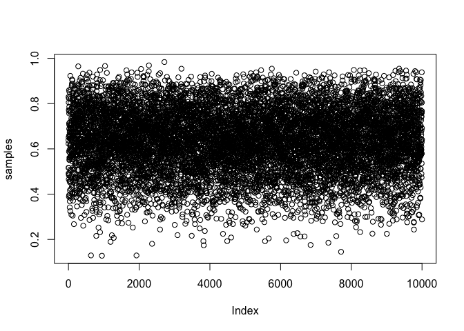
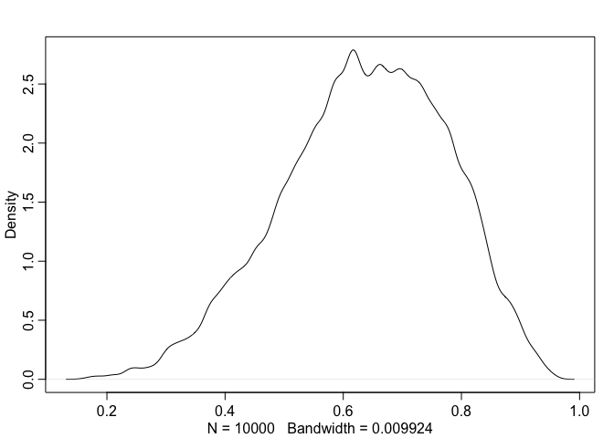

# Notes_StatisticalRethinking
Krisma Adiwibawa

## Globe tossing (Grid Approximation)

``` r
# define grid
p_grid <- seq(0, 1, length.out=20)

# define prior
prior <- ifelse(p_grid < 0.5, 0, 1)
prior <- exp(-5 * abs(p_grid-0.5)) # exponential decay function / Laplace distribution

# compute likelihood at each value in grid
likelihood <- dbinom(6, 9, p_grid)

# compute product of likelihood and prior
unstd.posterior <- likelihood * prior

# standardize the posterior, so it sums to 1
posterior <- unstd.posterior / sum(unstd.posterior)
```

## Plot

``` r
plot(p_grid, posterior, type="b", xlab = "probability of water", ylab = "posterior probability")
mtext("20 points")
```


## Globe Tossing (Quadratic Approximation)

``` r
library(rethinking)
```

    Loading required package: cmdstanr

    This is cmdstanr version 0.8.0

    - CmdStanR documentation and vignettes: mc-stan.org/cmdstanr

    - CmdStan path: /Users/krisma.adiwibawa/.cmdstan/cmdstan-2.36.0

    - CmdStan version: 2.36.0

    Loading required package: posterior

    This is posterior version 1.6.1


    Attaching package: 'posterior'

    The following objects are masked from 'package:stats':

        mad, sd, var

    The following objects are masked from 'package:base':

        %in%, match

    Loading required package: parallel

    rethinking (Version 2.42)


    Attaching package: 'rethinking'

    The following object is masked from 'package:stats':

        rstudent

``` r
globe.qa <- quap(
  alist(
    W ~ dbinom(W+L, p), # binomial likelihood
    p ~ dunif(0,1) # uniform prior
    ),
    data=list(W=6, L=3)
)

# display summary of quadratic approximation
precis(globe.qa)
```

           mean        sd      5.5%     94.5%
    p 0.6666668 0.1571337 0.4155368 0.9177969

## Compare how good the approximation is

``` r
# analytical calculation
W <- 6
L <- 3
curve(dbeta(x, W+1, L+1), from=0, to=1)

# quadratic approximation
curve(dnorm(x, 0.67, 0.16), lty=2, add=TRUE)
```


## Globe Tossing (Markov Chain Monte Carlo)

``` r
n_samples <- 1000
p <- rep(NA, n_samples)
p[1] <- 0.5
W <- 6
L <- 3
for (i in 2:n_samples) {
    p_new <- rnorm(1, p[i-1], 0.1)
    if (p_new < 0) p_new <- abs(p_new)
    if (p_new > 1) p_new <- 2- p_new
    q0 <- dbinom(W, W+L, p[i-1])
    q1 <- dbinom(W, W+L, p_new)
    p[i] <- ifelse(runif(1) < q1/q0, p_new, p[i-1])
}
```

## The values in p are samples from the posterior distribution. To compare to the analytical posterior:

``` r
dens(p, xlim=c(0,1))
curve(dbeta(x, W+1, L+1), lty=2, add=TRUE)
```


## Vampire test

``` r
Pr_Positive_Vampire <- 0.95
Pr_Positive_Mortal <- 0.01
Pr_Vampire <- 0.001
Pr_Positive <- Pr_Positive_Vampire * Pr_Vampire + Pr_Positive_Mortal * (1-Pr_Vampire)

(Pr_Vampire_Positive <- (Pr_Positive_Vampire * Pr_Vampire) / Pr_Positive)
```

    [1] 0.08683729

``` r
# 8.7% chance that the suspect is actually a vampire
```

## Sampling from a grid-approximate posterior

``` r
p_grid <- seq(from=0, to=1, length.out=10000)
prob_p <- rep(1, 10000)
prob_data <- dbinom(6, size=9, prob=p_grid)
posterior <- prob_data * prob_p
posterior <- posterior / sum(posterior)
```

# Now, we want to take 10000 samples from the posterior

``` r
samples <- sample(p_grid, prob=posterior, size=1e4, replace=TRUE)
View(table(samples))
plot(samples)
```



``` r
dens(samples)
```


## Chapter 3 - Practice

``` r
p_grid <- seq(from=0, to=1, length.out=1000)
prior <- rep(1, 1000)
likelihood <- dbinom(6, size=9, prob=p_grid)
posterior <- likelihood * prior
posterior <- posterior / sum(posterior)
set.seed(100)
samples <- sample(p_grid, prob=posterior, size=1e4, replace=TRUE)

# How much posterior probability lies below p = 0.2?
(sum(samples < 0.2)/1e4)
```

    [1] 4e-04

``` r
# How much posterior probability lies above p = 0.8?
(sum(samples > 0.8)/1e4)
```

    [1] 0.1116

``` r
# How much posterior probability lies between p = 0.2 and p = 0.8?
(sum(samples > 0.2 & samples < 0.8)/1e4)
```

    [1] 0.888

``` r
# 20% of the posterior probability lies below which value of p?
(quantile(samples, 0.2))
```

          20% 
    0.5185185 

``` r
# 20% of the posterior probability lies above which value of p?
(quantile(samples, 0.8))
```

          80% 
    0.7557558 

``` r
# Which values of p contain the narrowest interval equal to 66% of the posterior probability?
(HPDI(samples, prob=0.66))
```

        |0.66     0.66| 
    0.5085085 0.7737738 

``` r
# Suppose the globe tossing data had turned out to be 8 water in 15 tosses. Construct the posterior distribution, using grid approximation. Use the same flat prior as before.
p_grid <- seq(from=0, to=1, length.out=1000)
prior <- rep(1, 1000)
likelihood <- dbinom(8, size=15, prob=p_grid)
posterior <- likelihood * prior
posterior <- posterior/sum(posterior)

plot(p_grid, posterior, type="b",
     xlab="probability of water", ylab="posterior probability")
mtext("20 points")
```


``` r
# Draw 10,000 samples from the grid approximation from above. Then use the samples to calculate the 90% HPDI for p.

samples <- sample(p_grid, prob=posterior, size=1e4, replace=TRUE)

(HPDI(samples, prob=0.9))
```

         |0.9      0.9| 
    0.3293293 0.7167167 

``` r
plot(samples)
```



``` r
dens(samples)
```


``` r
precis(samples)
```

                 mean        sd      5.5%     94.5% histogram
    samples 0.5301517 0.1175499 0.3363363 0.7157157  ▁▁▂▇▇▅▂▁

``` r
# Construct a posterior predictive check for this model and data. This means simulate the distribution of samples, averaging over the posterior uncertainty in p. What is the probability of observing 8 water in 15 tosses?

post_pred_check <- rbinom(1e4, size=15, prob=samples)
(mean(post_pred_check == 8))
```

    [1] 0.1444

``` r
simplehist(post_pred_check, xlab="posterior predictive distribution")
```


``` r
# Using the posterior distribution constructed from the new (8/15) data, now calculate the probability of observing 6 water in 9 tosses

prob_6_in_9 <- sum( dbinom(6, size=9, prob=p_grid) * posterior )
prob_6_in_9
```

    [1] 0.1763898

``` r
# or

prob_6_in_9 <- mean( dbinom(6, size=9, prob=samples) )
prob_6_in_9
```

    [1] 0.1770468

``` r
# visualization
set.seed(123)
post_pred_samples <- rbinom(10000, size=9, prob=samples)
simplehist(post_pred_samples, xlab="Number of water tosses")
```


test123
